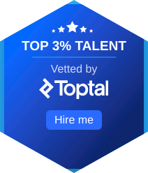

## 👋 Hi! I'm KC - Mobile · Agentic AI · Full Stack Developer

  

## 🚀 About Me

I'm a developer who works across the full product stack — from native and cross-platform mobile apps to agentic AI systems, AWS cloud infrastructure, and production-ready web backends.

- 📱 **Mobile** — Android & iOS with **Kotlin**, **Jetpack Compose**, **Swift**, **SwiftUI**, **React Native**, and **Flutter**
- 🤖 **AI** — Agentic systems, prompt engineering, and LLM-powered features in production
- ☁️ **AWS** — Professional experience designing and deploying scalable cloud infrastructure
- 🌐 **Full Stack** — End-to-end solutions with modern frameworks, APIs, and backend services
- 🛠️ **Craft** — Strong focus on user experience, performance, and maintainable architecture
- 🧠 **Growth** — Continuously exploring new tools, patterns, and technologies
- 🤝 **Collaboration** — Top 3% Toptal-vetted talent available for freelance and contract work

## 👨‍💻 Favorite Stacks

**Mobile**
- Kotlin · Jetpack Compose
- Swift · SwiftUI
- React Native
- Flutter · Dart

**AI**
- Agentic AI · Multi-agent workflows
- Prompt Engineering · RAG
- LangChain · LangGraph
- OpenAI · Claude · LLM APIs

**Cloud**
- AWS (Lambda, ECS, S3, API Gateway, RDS)
- Infrastructure as Code · CI/CD

**Full Stack**
- TypeScript · JavaScript
- React · Next.js
- Node.js
- REST · GraphQL

## 📈 GitHub Stats

## 🌐 Connect with Me

